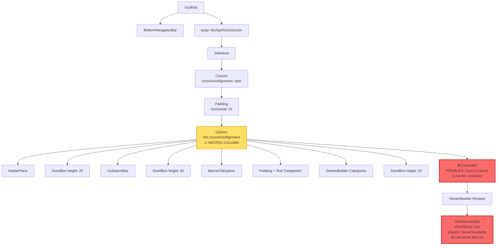
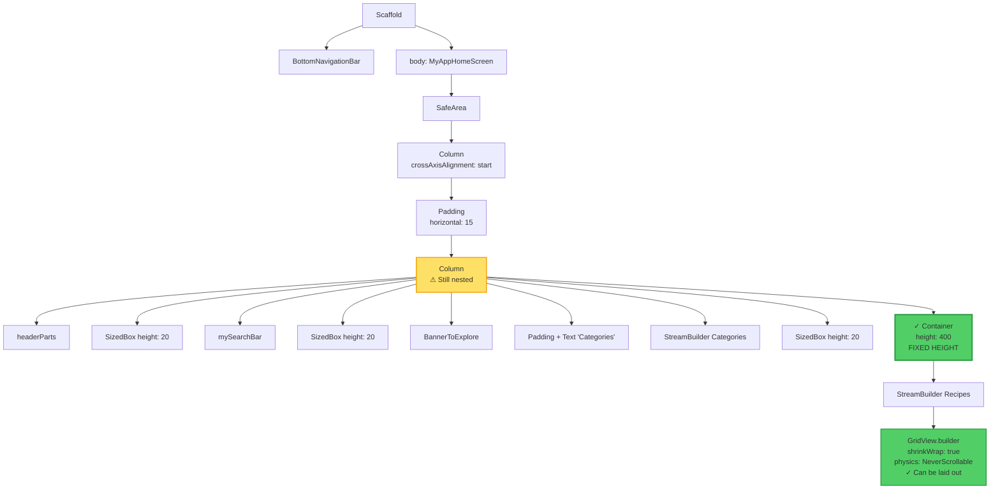
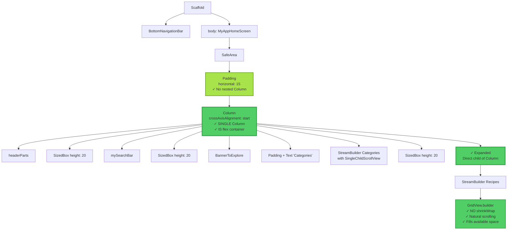
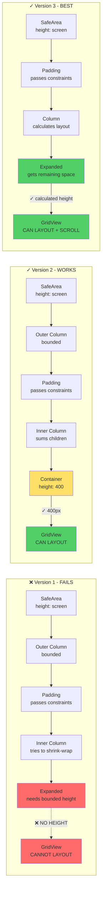
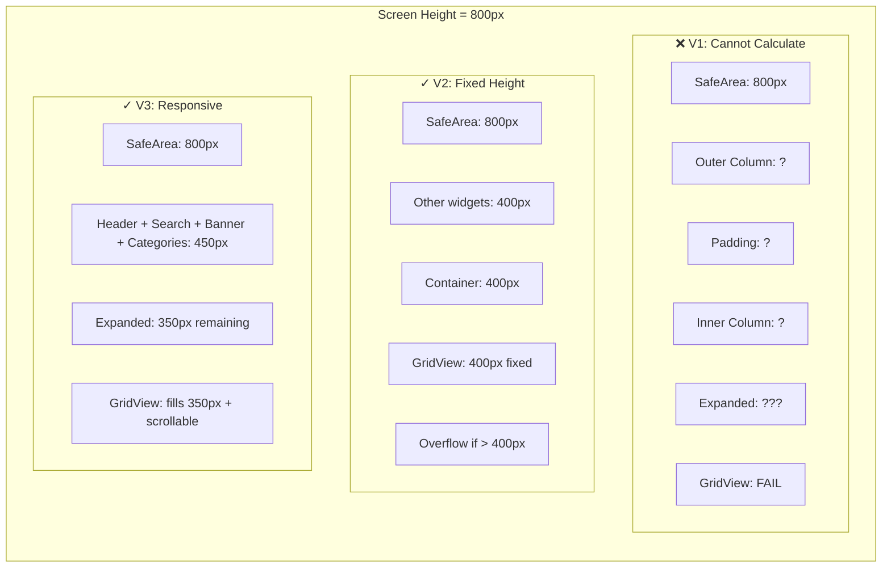
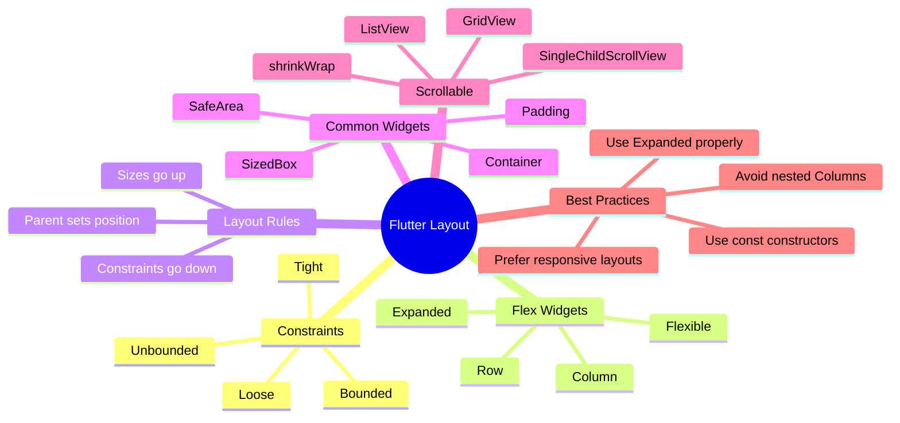

# Flutter Layout Quiz & Complete Widget Trees

## Part 1: Detailed Widget Tree Diagrams

### Version 1 - Broken Structure ❌



### Version 2 - Fixed Height Workaround ✓



### Version 3 - Proper Structure ✓



### Constraint Flow Comparison



### Memory Layout Visualization



---

## Part 2: Quiz on Flutter Layout System

### Section A: Questions à Choix Multiples (QCM)

#### Question 1
**Quelle est la cause principale de l'erreur "Cannot hit test a render box that has never been laid out" dans la Version 1?**

A) Le GridView n'a pas de données  
B) Le widget Expanded est dans une Column qui n'est pas un flex container approprié  
C) Le StreamBuilder n'est pas correctement configuré  
D) La couleur de fond n'est pas définie  

<details>
<summary>Réponse</summary>

**B) Le widget Expanded est dans une Column qui n'est pas un flex container approprié**

Explication: La Column interne essaie de s'ajuster à ses enfants (shrink-wrap) mais contient un widget Expanded qui nécessite des contraintes bornées. C'est une contradiction qui empêche le layout.
</details>

---

#### Question 2
**Dans la Version 2, quelle modification permet de résoudre le problème?**

A) Ajout de shrinkWrap: true  
B) Remplacement de Expanded par Container(height: 400)  
C) Utilisation de ListView au lieu de GridView  
D) Suppression du StreamBuilder  

<details>
<summary>Réponse</summary>

**B) Remplacement de Expanded par Container(height: 400)**

Explication: En donnant une hauteur fixe explicite, la Column interne peut calculer sa taille totale et le GridView reçoit des contraintes bornées.
</details>

---

#### Question 3
**Quel est le principal inconvénient de la Version 2?**

A) Elle ne fonctionne pas  
B) Elle n'est pas responsive (hauteur fixe de 400px)  
C) Elle consomme trop de mémoire  
D) Elle ne supporte pas Firebase  

<details>
<summary>Réponse</summary>

**B) Elle n'est pas responsive (hauteur fixe de 400px)**

Explication: La hauteur fixe de 400px ne s'adapte pas aux différentes tailles d'écran, ce qui peut causer des problèmes sur petits ou grands écrans.
</details>

---

#### Question 4
**Dans la Version 3, quelle amélioration structurelle majeure est apportée?**

A) Utilisation de setState plus fréquent  
B) Suppression de la Column imbriquée (Padding → Column au lieu de Column → Padding → Column)  
C) Ajout de plus de StreamBuilders  
D) Utilisation de GridView.count au lieu de GridView.builder  

<details>
<summary>Réponse</summary>

**B) Suppression de la Column imbriquée (Padding → Column au lieu de Column → Padding → Column)**

Explication: La restructuration élimine la Column imbriquée problématique, permettant à Expanded d'être un enfant direct de la Column principale qui est un vrai flex container.
</details>

---

#### Question 5
**Que signifie "shrinkWrap: true" dans un GridView?**

A) Le GridView occupe tout l'espace disponible  
B) Le GridView se dimensionne selon son contenu plutôt que de remplir l'espace parent  
C) Le GridView devient scrollable  
D) Le GridView se redimensionne automatiquement  

<details>
<summary>Réponse</summary>

**B) Le GridView se dimensionne selon son contenu plutôt que de remplir l'espace parent**

Explication: shrinkWrap fait que le GridView calcule sa hauteur en fonction du nombre d'items plutôt que d'utiliser l'espace disponible.
</details>

---

#### Question 6
**Pourquoi "physics: NeverScrollableScrollPhysics()" est-il utilisé dans les Versions 1 et 2?**

A) Pour améliorer les performances  
B) Pour désactiver le scroll du GridView car il est dans une structure déjà scrollable  
C) Pour activer le scroll horizontal  
D) C'est obligatoire avec shrinkWrap  

<details>
<summary>Réponse</summary>

**B) Pour désactiver le scroll du GridView car il est dans une structure déjà scrollable**

Explication: Avec shrinkWrap: true, on veut généralement que le GridView ne scroll pas lui-même mais qu'il fasse partie d'une zone scrollable plus grande.
</details>

---

#### Question 7
**Dans la Version 3, quel widget permet aux catégories de défiler horizontalement?**

A) ListView  
B) PageView  
C) SingleChildScrollView avec scrollDirection: Axis.horizontal  
D) GridView avec scrollDirection: Axis.horizontal  

<details>
<summary>Réponse</summary>

**C) SingleChildScrollView avec scrollDirection: Axis.horizontal**

Explication: La Version 3 entoure la Row des catégories avec un SingleChildScrollView horizontal pour permettre le défilement si les catégories dépassent la largeur de l'écran.
</details>

---

#### Question 8
**Quel est le rôle du widget Expanded dans Flutter?**

A) Agrandir le texte  
B) Occuper tout l'espace disponible dans un flex container (Row/Column)  
C) Créer une animation d'expansion  
D) Rendre un widget cliquable  

<details>
<summary>Réponse</summary>

**B) Occuper tout l'espace disponible dans un flex container (Row/Column)**

Explication: Expanded prend l'espace restant après que tous les widgets non-flex aient été dimensionnés dans une Row ou Column.
</details>

---

#### Question 9
**Quelle condition doit être respectée pour utiliser Expanded?**

A) Il doit être dans un Container  
B) Il doit être enfant direct d'une Row, Column ou Flex  
C) Il doit contenir un Text widget  
D) Il doit avoir une couleur de fond  

<details>
<summary>Réponse</summary>

**B) Il doit être enfant direct d'une Row, Column ou Flex**

Explication: Expanded ne fonctionne que comme enfant direct d'un widget flex (Row, Column, Flex).
</details>

---

#### Question 10
**Dans la Version 3, pourquoi enlève-t-on "shrinkWrap: true" du GridView?**

A) Pour économiser de la mémoire  
B) Pour permettre au GridView de scroller naturellement dans l'espace fourni par Expanded  
C) Pour corriger une erreur de compilation  
D) Pour changer la direction du scroll  

<details>
<summary>Réponse</summary>

**B) Pour permettre au GridView de scroller naturellement dans l'espace fourni par Expanded**

Explication: Sans shrinkWrap, le GridView utilise l'espace fourni par Expanded et gère son propre scroll, ce qui est plus performant et naturel.
</details>

---

### Section B: Vrai ou Faux

#### Question 11
**Un widget Column peut contenir un widget Expanded sans conditions particulières.**

- [ ] Vrai
- [ ] Faux

<details>
<summary>Réponse</summary>

**Faux**

Explication: La Column doit elle-même avoir des contraintes bornées dans l'axe principal (vertical) pour que Expanded puisse calculer l'espace disponible.
</details>

---

#### Question 12
**Il est recommandé d'imbriquer plusieurs Columns les unes dans les autres pour organiser le layout.**

- [ ] Vrai
- [ ] Faux

<details>
<summary>Réponse</summary>

**Faux**

Explication: Imbriquer des Columns est généralement un anti-pattern qui peut causer des problèmes de contraintes. Il vaut mieux restructurer avec Padding et une seule Column principale.
</details>

---

#### Question 13
**La Version 2 fonctionne sur tous les types d'écrans de manière optimale.**

- [ ] Vrai
- [ ] Faux

<details>
<summary>Réponse</summary>

**Faux**

Explication: La Version 2 utilise une hauteur fixe de 400px qui n'est pas responsive et peut causer des problèmes sur différentes tailles d'écran.
</details>

---

#### Question 14
**SafeArea empêche le contenu de se superposer aux zones système (notch, barre de statut, etc.).**

- [ ] Vrai
- [ ] Faux

<details>
<summary>Réponse</summary>

**Vrai**

Explication: SafeArea ajoute automatiquement du padding pour éviter les zones système de l'appareil.
</details>

---

#### Question 15
**StreamBuilder permet de reconstruire automatiquement le widget quand les données Firestore changent.**

- [ ] Vrai
- [ ] Faux

<details>
<summary>Réponse</summary>

**Vrai**

Explication: StreamBuilder écoute un Stream et reconstruit son builder à chaque nouvelle émission de données.
</details>

---

### Section C: Questions à Compléter

#### Question 16
**Complétez le code pour créer une Column responsive avec un Expanded:**

```dart
SafeArea(
  child: __________(  // Widget pour espacement
    padding: EdgeInsets.all(15),
    child: __________(  // Widget flex container
      children: [
        Text("Header"),
        __________(  // Widget qui prend l'espace restant
          child: ListView(...),
        ),
      ],
    ),
  ),
)
```

<details>
<summary>Réponse</summary>

```dart
SafeArea(
  child: Padding(  // Widget pour espacement
    padding: EdgeInsets.all(15),
    child: Column(  // Widget flex container
      children: [
        Text("Header"),
        Expanded(  // Widget qui prend l'espace restant
          child: ListView(...),
        ),
      ],
    ),
  ),
)
```
</details>

---

#### Question 17
**Complétez les paramètres du GridView pour le rendre non-scrollable avec shrink-wrap:**

```dart
GridView.builder(
  shrinkWrap: __________,
  physics: __________,
  gridDelegate: SliverGridDelegateWithFixedCrossAxisCount(
    crossAxisCount: 2,
  ),
  itemBuilder: (context, index) => Container(),
)
```

<details>
<summary>Réponse</summary>

```dart
GridView.builder(
  shrinkWrap: true,
  physics: NeverScrollableScrollPhysics(),
  gridDelegate: SliverGridDelegateWithFixedCrossAxisCount(
    crossAxisCount: 2,
  ),
  itemBuilder: (context, index) => Container(),
)
```
</details>

---

#### Question 18
**Complétez pour créer une rangée de boutons scrollable horizontalement:**

```dart
__________(
  scrollDirection: Axis.__________,
  child: Row(
    children: categories.map((cat) => 
      ElevatedButton(
        child: Text(cat),
        onPressed: () {},
      )
    ).toList(),
  ),
)
```

<details>
<summary>Réponse</summary>

```dart
SingleChildScrollView(
  scrollDirection: Axis.horizontal,
  child: Row(
    children: categories.map((cat) => 
      ElevatedButton(
        child: Text(cat),
        onPressed: () {},
      )
    ).toList(),
  ),
)
```
</details>

---

### Section D: Questions d'Analyse

#### Question 19
**Analysez ce code et identifiez le problème:**

```dart
Column(
  children: [
    Text("Title"),
    Padding(
      padding: EdgeInsets.all(10),
      child: Column(
        children: [
          Text("Subtitle"),
          Expanded(
            child: ListView.builder(
              itemCount: 100,
              itemBuilder: (context, index) => Text("Item $index"),
            ),
          ),
        ],
      ),
    ),
  ],
)
```

**Quel est le problème et comment le corriger?**

<details>
<summary>Réponse</summary>

**Problème:** Expanded est dans une Column imbriquée qui n'a pas de contraintes bornées. La Column interne essaie de s'ajuster à ses enfants mais Expanded nécessite de connaître l'espace disponible.

**Solutions possibles:**

1. **Solution A (Restructurer):**
```dart
Column(
  children: [
    Text("Title"),
    Padding(
      padding: EdgeInsets.symmetric(horizontal: 10),
      child: Text("Subtitle"),
    ),
    Expanded(  // Expanded au niveau de la Column principale
      child: Padding(
        padding: EdgeInsets.symmetric(horizontal: 10),
        child: ListView.builder(
          itemCount: 100,
          itemBuilder: (context, index) => Text("Item $index"),
        ),
      ),
    ),
  ],
)
```

2. **Solution B (Hauteur fixe):**
```dart
Column(
  children: [
    Text("Title"),
    Padding(
      padding: EdgeInsets.all(10),
      child: Column(
        children: [
          Text("Subtitle"),
          Container(
            height: 400,  // Hauteur fixe
            child: ListView.builder(
              itemCount: 100,
              itemBuilder: (context, index) => Text("Item $index"),
            ),
          ),
        ],
      ),
    ),
  ],
)
```
</details>

---

#### Question 20
**Comparez les performances: shrinkWrap: true vs Expanded. Quelle approche est plus performante et pourquoi?**

<details>
<summary>Réponse</summary>

**Expanded est plus performant.**

**Raisons:**

1. **Avec shrinkWrap: true:**
   - Le GridView/ListView doit calculer la taille de TOUS ses items avant de s'afficher
   - Tous les items sont construits même s'ils ne sont pas visibles
   - Consomme plus de mémoire et CPU
   - Pas de virtualisation efficace

2. **Avec Expanded (sans shrinkWrap):**
   - Le GridView/ListView connaît sa taille immédiatement (l'espace fourni par Expanded)
   - Seuls les items visibles + quelques items hors écran sont construits
   - Virtualisation efficace (lazy loading)
   - Meilleure utilisation de la mémoire

**Exemple de différence:**
- 1000 items avec shrinkWrap: true → construit 1000 widgets
- 1000 items avec Expanded → construit ~20 widgets visibles à la fois
</details>

---

### Section E: Questions de Débogage

#### Question 21
**Un développeur obtient cette erreur:**

```
RenderFlex children have non-zero flex but incoming height constraints are unbounded.
```

**Quelles sont les 3 causes possibles et leurs solutions?**

<details>
<summary>Réponse</summary>

**Cause 1: Expanded dans Column sans contraintes**
```dart
// ❌ Problème
ListView(
  children: [
    Column(
      children: [
        Expanded(child: Container()),  // Erreur!
      ],
    ),
  ],
)

// ✓ Solution: Utiliser SizedBox ou hauteur fixe
ListView(
  children: [
    SizedBox(
      height: 200,
      child: Column(
        children: [
          Expanded(child: Container()),
        ],
      ),
    ),
  ],
)
```

**Cause 2: Column dans ListView sans hauteur**
```dart
// ❌ Problème
ListView(
  children: [
    Column(
      children: [
        Expanded(child: Container()),
      ],
    ),
  ],
)

// ✓ Solution: Ne pas utiliser Expanded dans ListView
ListView(
  children: [
    Column(
      children: [
        Container(height: 200),  // Hauteur explicite
      ],
    ),
  ],
)
```

**Cause 3: Expanded dans Column imbriquée**
```dart
// ❌ Problème
Column(
  children: [
    Column(
      children: [
        Expanded(child: Container()),  // Erreur!
      ],
    ),
  ],
)

// ✓ Solution: Expanded dans la Column principale
Column(
  children: [
    Text("Header"),
    Expanded(child: Container()),
  ],
)
```
</details>

---

#### Question 22
**Quel outil ou technique utiliseriez-vous pour diagnostiquer un problème de layout Flutter?**

A) print() statements  
B) Flutter DevTools - Widget Inspector  
C) Ajouter des Container avec des couleurs  
D) debugPaintSizeEnabled = true  
E) Toutes les réponses ci-dessus  

<details>
<summary>Réponse</summary>

**E) Toutes les réponses ci-dessus**

**Explication détaillée:**

1. **print() statements:**
   - Imprimer les contraintes: `print(constraints)`
   - Vérifier les données: `print(snapshot.data?.docs.length)`

2. **Flutter DevTools - Widget Inspector:**
   - Visualiser l'arbre des widgets
   - Voir les contraintes et dimensions de chaque widget
   - Identifier les widgets qui causent l'overflow
   - Mode "Select Widget" pour inspection interactive

3. **Container avec couleurs:**
   ```dart
   Container(
     color: Colors.red.withOpacity(0.3),  // Pour voir la zone occupée
     child: MyWidget(),
   )
   ```

4. **debugPaintSizeEnabled:**
   ```dart
   void main() {
     debugPaintSizeEnabled = true;  // Affiche les bordures de layout
     runApp(MyApp());
   }
   ```

5. **Autres outils utiles:**
   - `debugPaintBaselinesEnabled = true` - lignes de base du texte
   - `debugPaintPointersEnabled = true` - zones de tap
   - Wrap avec `LayoutBuilder` pour voir les contraintes:
   ```dart
   LayoutBuilder(
     builder: (context, constraints) {
       print('Max height: ${constraints.maxHeight}');
       return MyWidget();
     },
   )
   ```
</details>

---

### Section F: Question de Synthèse

#### Question 23
**Vous devez créer une page avec:**
- Un header fixe (100px)
- Une zone de contenu scrollable qui prend le reste de l'écran
- Un footer fixe (50px)

**Écrivez le code Flutter complet et justifiez vos choix.**

<details>
<summary>Réponse</summary>

```dart
import 'package:flutter/material.dart';

class MyPage extends StatelessWidget {
  const MyPage({Key? key}) : super(key: key);

  @override
  Widget build(BuildContext context) {
    return Scaffold(
      body: SafeArea(
        child: Column(  // Column principale - flex container
          children: [
            // Header fixe
            Container(
              height: 100,
              color: Colors.blue,
              child: Center(
                child: Text(
                  'Header',
                  style: TextStyle(
                    color: Colors.white,
                    fontSize: 24,
                    fontWeight: FontWeight.bold,
                  ),
                ),
              ),
            ),
            
            // Zone scrollable - prend l'espace restant
            Expanded(  // Occupe: hauteur écran - 100 - 50
              child: ListView.builder(
                itemCount: 50,
                itemBuilder: (context, index) {
                  return ListTile(
                    title: Text('Item $index'),
                    subtitle: Text('Description for item $index'),
                    leading: CircleAvatar(child: Text('$index')),
                  );
                },
              ),
            ),
            
            // Footer fixe
            Container(
              height: 50,
              color: Colors.grey[800],
              child: Row(
                mainAxisAlignment: MainAxisAlignment.spaceEvenly,
                children: [
                  IconButton(
                    icon: Icon(Icons.home, color: Colors.white),
                    onPressed: () {},
                  ),
                  IconButton(
                    icon: Icon(Icons.search, color: Colors.white),
                    onPressed: () {},
                  ),
                  IconButton(
                    icon: Icon(Icons.person, color: Colors.white),
                    onPressed: () {},
                  ),
                ],
              ),
            ),
          ],
        ),
      ),
    );
  }
}
```

**Justifications:**

1. **Scaffold + SafeArea:**
   - Structure de base Flutter
   - SafeArea évite le notch et les zones système

2. **Column principale:**
   - Flex container pour organiser verticalement
   - Permet d'utiliser Expanded

3. **Header avec hauteur fixe (Container):**
   - `height: 100` - dimension explicite
   - Ne change pas de taille

4. **Expanded pour le contenu:**
   - Prend automatiquement l'espace restant
   - Responsive à toutes les tailles d'écran
   - Calcul: hauteur écran - SafeArea padding - 100 (header) - 50 (footer)

5. **ListView dans Expanded:**
   - Pas besoin de shrinkWrap
   - Scroll naturel et performant
   - Virtualisation des items (lazy loading)

6. **Footer avec hauteur fixe:**
   - Similaire au header
   - Reste toujours visible en bas

**Avantages de cette approche:**
- ✓ Responsive (s'adapte à toutes les tailles)
- ✓ Performant (ListView virtualisé)
- ✓ Pas de contraintes conflictuelles
- ✓ Code propre et maintenable

**Alternative sans Expanded (moins recommandée):**
```dart
Column(
  children: [
    Container(height: 100, child: Header()),
    Container(
      height: MediaQuery.of(context).size.height - 150 - MediaQuery.of(context).padding.top,
      child: ListView(...),
    ),
    Container(height: 50, child: Footer()),
  ],
)
```
Cette approche nécessite un calcul manuel et est moins flexible.
</details>

---

## Barème et Scoring

### Points par section:
- **Section A (QCM 1-10):** 2 points chacune = 20 points
- **Section B (Vrai/Faux 11-15):** 1 point chacune = 5 points
- **Section C (À compléter 16-18):** 3 points chacune = 9 points
- **Section D (Analyse 19-20):** 8 points chacune = 16 points
- **Section E (Débogage 21-22):** 10 points chacune = 20 points
- **Section F (Synthèse 23):** 30 points

**Total:** 100 points

### Niveaux de compétence:
- **90-100 points:** Expert Flutter Layout
- **75-89 points:** Compétent avancé
- **60-74 points:** Compétent intermédiaire
- **45-59 points:** Compétence de base
- **0-44 points:** Besoin de révision

---

## Concepts Clés à Retenir



---

## Erreurs Courantes et Solutions Rapides

| Erreur | Cause | Solution |
|--------|-------|----------|
| Cannot hit test a render box | Widget non layouté | Vérifier les contraintes et Expanded |
| RenderFlex overflowed | Pas assez d'espace | Utiliser Expanded ou SingleChildScrollView |
| Unbounded height constraints | ListView/GridView sans contraintes | Wrapper dans SizedBox ou utiliser Expanded |
| Incorrect use of ParentDataWidget | Expanded hors de Column/Row | Déplacer Expanded dans flex parent |
| A RenderFlex overflowed by X pixels | Contenu dépasse | Ajouter scroll ou réduire contenu |

---

## Ressources Supplémentaires

1. **Documentation officielle:**
   - https://docs.flutter.dev/ui/layout/constraints
   - https://docs.flutter.dev/ui/layout

2. **Vidéos recommandées:**
   - Flutter Widget of the Week - Expanded
   - Understanding Constraints in Flutter

3. **Articles:**
   - "Understanding Flutter's Box Constraints"
   - "The Expanded and Flexible widgets explained"

4. **Outils:**
   - Flutter DevTools
   - Widget Inspector
   - Layout Explorer

