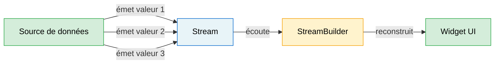
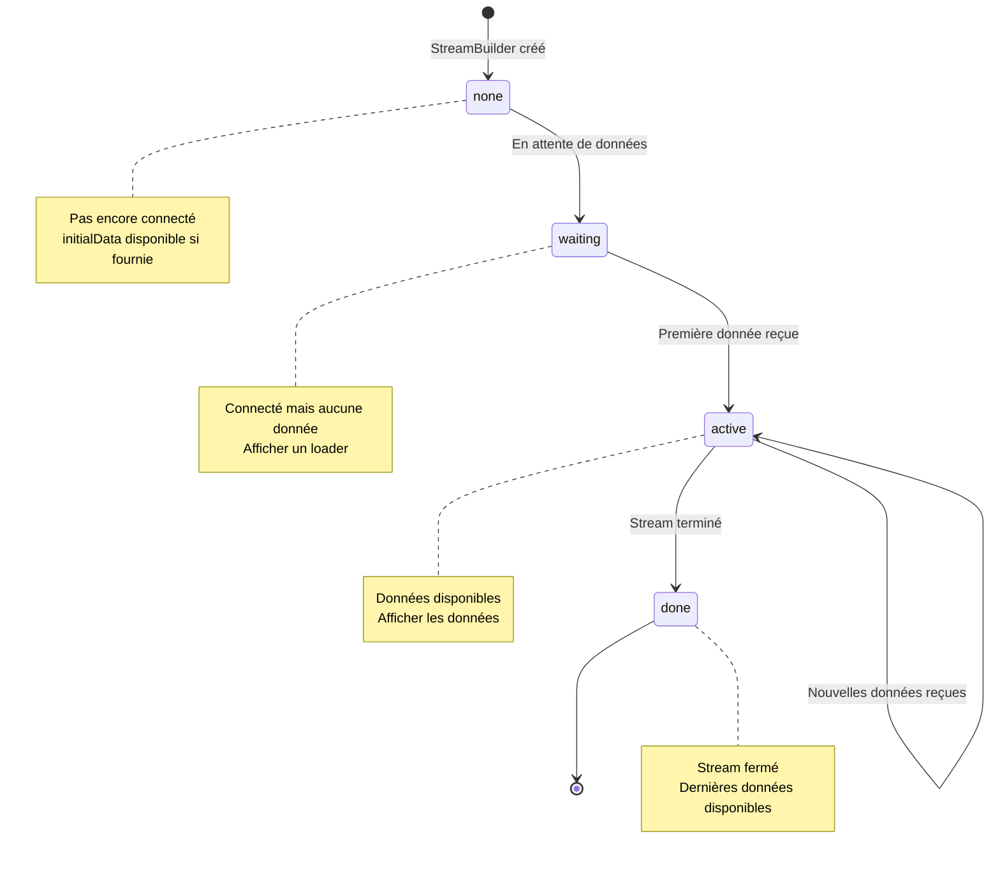
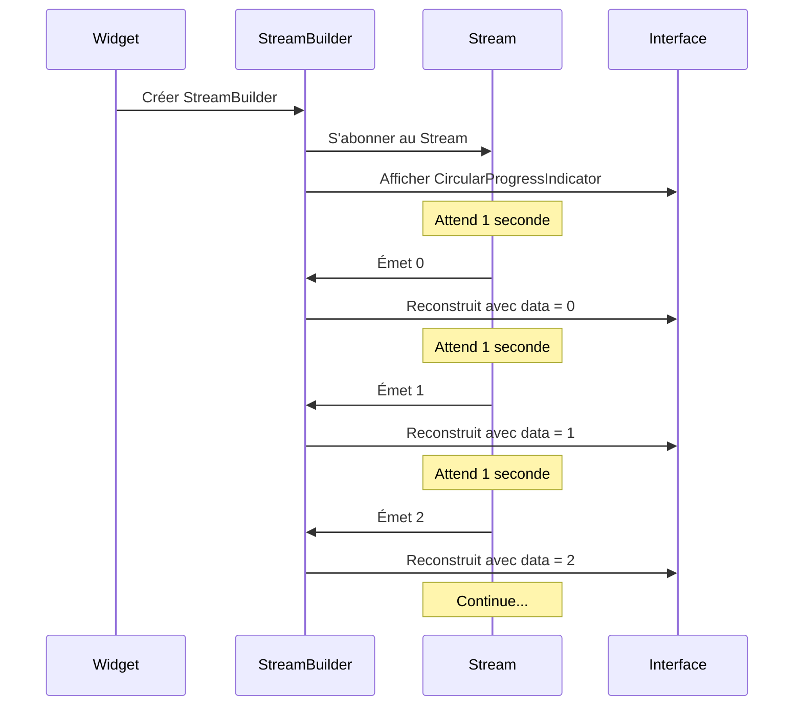
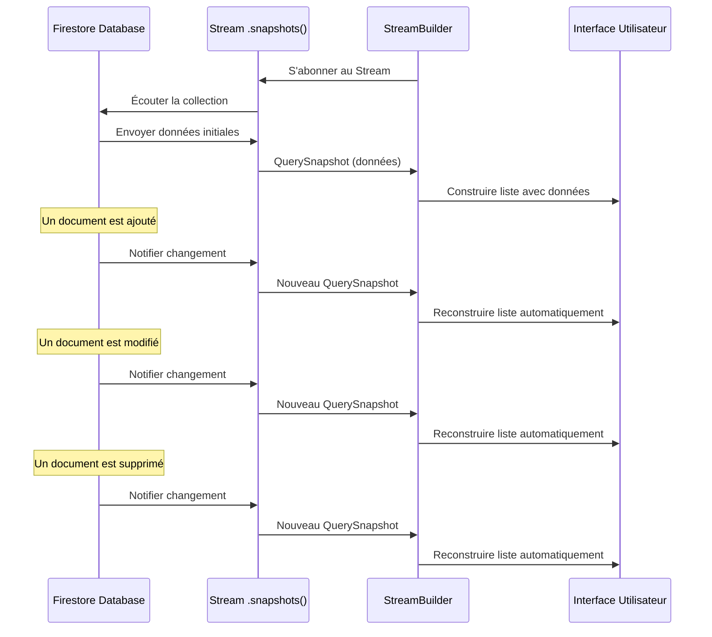
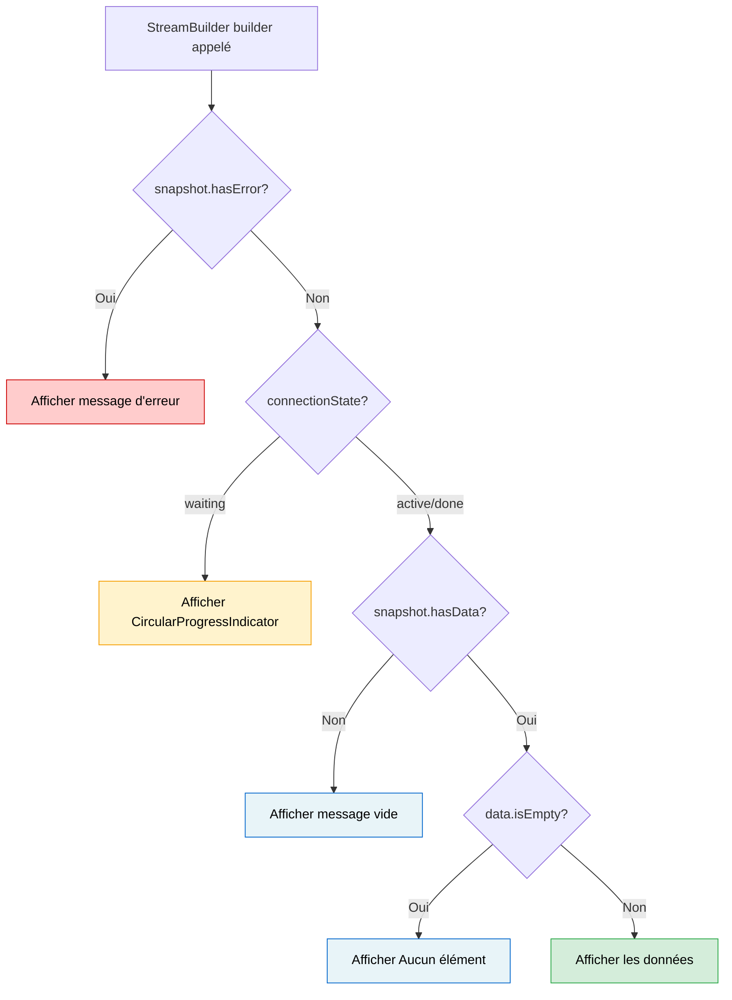
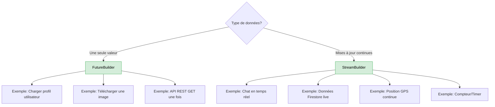

# Cours Complet sur StreamBuilder en Flutter

## Table des Matières
1. [Introduction aux Streams](#introduction-aux-streams)
2. [Qu'est-ce que StreamBuilder?](#quest-ce-que-streambuilder)
3. [Anatomie d'un StreamBuilder](#anatomie-dun-streambuilder)
4. [Exemples Progressifs](#exemples-progressifs)
5. [StreamBuilder avec Firebase](#streambuilder-avec-firebase)
6. [Gestion des États](#gestion-des-états)
7. [Bonnes Pratiques](#bonnes-pratiques)
8. [Erreurs Courantes](#erreurs-courantes)

---

## Introduction aux Streams

### Qu'est-ce qu'un Stream?

Un **Stream** est comme un tuyau d'eau qui transporte des données au fil du temps. Contrairement à une variable normale qui contient une seule valeur, un Stream peut émettre plusieurs valeurs successivement.



### Analogie de la vie réelle

**Stream = Chaîne YouTube**
- La chaîne (Stream) publie des vidéos au fil du temps
- Vous vous abonnez (listen) à la chaîne
- Vous recevez une notification à chaque nouvelle vidéo (nouvelle donnée)
- Vous pouvez regarder (utiliser) chaque vidéo

### Types de données pour Stream

```dart
Stream<int>           // Stream d'entiers
Stream<String>        // Stream de textes
Stream<User>          // Stream d'objets User
Stream<List<Recipe>>  // Stream de listes de recettes
Stream<QuerySnapshot> // Stream de données Firestore
```

### Exemple Simple: Compter les secondes

```dart
// Créer un Stream qui émet un nombre chaque seconde
Stream<int> counterStream() {
  return Stream.periodic(
    Duration(seconds: 1),  // Intervalle d'émission
    (count) => count,      // Valeur à émettre
  );
}

// Utilisation
counterStream().listen((valeur) {
  print('Compteur: $valeur');
  // Affiche: Compteur: 0, Compteur: 1, Compteur: 2...
});
```

### Stream vs Future

```mermaid
%%{init: {'theme':'default', 'themeVariables': { 'primaryColor':'#e8f4f8','primaryTextColor':'#000','primaryBorderColor':'#0066cc','lineColor':'#333'}}}%%
graph TD
    subgraph Future["Future - Une seule valeur"]
        F1[Demande] --> F2[Attend...]
        F2 --> F3[Reçoit UNE réponse]
        F3 --> F4[Terminé]
        
        style F3 fill:#d4edda,stroke:#28a745,color:#000
    end
    
    subgraph Stream["Stream - Plusieurs valeurs"]
        S1[S'abonne] --> S2[Reçoit valeur 1]
        S2 --> S3[Reçoit valeur 2]
        S3 --> S4[Reçoit valeur 3]
        S4 --> S5[Continue...]
        
        style S2 fill:#d4edda,stroke:#28a745,color:#000
        style S3 fill:#d4edda,stroke:#28a745,color:#000
        style S4 fill:#d4edda,stroke:#28a745,color:#000
    end
```



**Future**: Comme commander un plat au restaurant
- Vous commandez
- Vous attendez
- Vous recevez votre plat (UNE FOIS)
- C'est terminé

**Stream**: Comme un abonnement Netflix
- Vous vous abonnez
- Vous recevez de nouveaux contenus en continu
- Vous pouvez regarder à tout moment
- Ça continue tant que vous êtes abonné

---

## Qu'est-ce que StreamBuilder?

### Définition

`StreamBuilder` est un widget Flutter qui **écoute un Stream** et **reconstruit automatiquement** l'interface utilisateur chaque fois qu'une nouvelle donnée arrive.

### Pourquoi utiliser StreamBuilder?

**Sans StreamBuilder** (manuel):
```dart
class MyWidget extends StatefulWidget {
  @override
  _MyWidgetState createState() => _MyWidgetState();
}

class _MyWidgetState extends State<MyWidget> {
  int _counter = 0;
  StreamSubscription? _subscription;
  
  @override
  void initState() {
    super.initState();
    // Écouter manuellement le Stream
    _subscription = counterStream().listen((value) {
      setState(() {
        _counter = value;  // Mettre à jour manuellement
      });
    });
  }
  
  @override
  void dispose() {
    _subscription?.cancel();  // Ne pas oublier de nettoyer!
    super.dispose();
  }
  
  @override
  Widget build(BuildContext context) {
    return Text('Compteur: $_counter');
  }
}
```

**Avec StreamBuilder** (automatique):
```dart
class MyWidget extends StatelessWidget {
  @override
  Widget build(BuildContext context) {
    return StreamBuilder<int>(
      stream: counterStream(),
      builder: (context, snapshot) {
        return Text('Compteur: ${snapshot.data ?? 0}');
      },
    );
  }
}
```

**Avantages de StreamBuilder:**
- Pas besoin de StatefulWidget
- Gestion automatique de l'abonnement (subscribe/unsubscribe)
- Pas besoin de setState()
- Moins de code
- Moins d'erreurs possibles (pas d'oubli de cancel())

---

## Anatomie d'un StreamBuilder

### Structure Complète

```dart
StreamBuilder<TypeDeDonnées>(
  stream: monStream,              // Le Stream à écouter
  initialData: valeurInitiale,    // (Optionnel) Donnée avant la première émission
  builder: (context, snapshot) {  // Fonction qui construit le widget
    // Code de construction du widget
    return MonWidget();
  },
)
```

### Les Paramètres

#### 1. stream (REQUIS)

Le Stream que vous voulez écouter.

```dart
// Exemples de streams
stream: counterStream()                    // Stream personnalisé
stream: myController.stream                // Stream d'un StreamController
stream: FirebaseFirestore.instance         // Stream Firestore
  .collection('recipes')
  .snapshots()
```

#### 2. initialData (OPTIONNEL)

La valeur à utiliser avant que le Stream n'émette sa première donnée.

```dart
StreamBuilder<int>(
  stream: counterStream(),
  initialData: 0,  // Affichera 0 au départ
  builder: (context, snapshot) {
    return Text('${snapshot.data}');  // Pas de null possible
  },
)
```

#### 3. builder (REQUIS)

Une fonction qui reçoit deux paramètres:
- `context`: Le BuildContext (comme d'habitude)
- `snapshot`: Un objet AsyncSnapshot contenant les infos du Stream

### L'objet AsyncSnapshot

`AsyncSnapshot` contient toutes les informations sur l'état actuel du Stream:

```dart
snapshot.connectionState  // État de la connexion au Stream
snapshot.data             // Les données reçues
snapshot.error            // L'erreur (si erreur)
snapshot.hasData          // true si des données sont disponibles
snapshot.hasError         // true si une erreur est survenue
```

### ConnectionState - Les 4 États



**Détails de chaque état:**

1. **ConnectionState.none**
   - Le StreamBuilder vient d'être créé
   - Pas encore connecté au Stream
   - Rare, généralement passe rapidement à waiting

2. **ConnectionState.waiting**
   - Connecté au Stream
   - En attente de la première donnée
   - **Action recommandée**: Afficher un indicateur de chargement

3. **ConnectionState.active**
   - Le Stream émet des données
   - Des données sont disponibles dans `snapshot.data`
   - **Action recommandée**: Afficher les données

4. **ConnectionState.done**
   - Le Stream est terminé (fermé)
   - Les dernières données sont toujours disponibles
   - Peu commun avec Firebase (streams infinis)

---

## Exemples Progressifs

### Exemple 1: Compteur Simple

Un compteur qui compte les secondes.

```dart
import 'package:flutter/material.dart';

class CounterExample extends StatelessWidget {
  // Stream qui émet un nombre chaque seconde
  Stream<int> counterStream() {
    return Stream.periodic(
      Duration(seconds: 1),
      (count) => count,
    );
  }

  @override
  Widget build(BuildContext context) {
    return Scaffold(
      appBar: AppBar(title: Text('Compteur StreamBuilder')),
      body: Center(
        child: StreamBuilder<int>(
          stream: counterStream(),
          builder: (context, snapshot) {
            // Vérifier l'état de la connexion
            if (snapshot.connectionState == ConnectionState.waiting) {
              return CircularProgressIndicator();
            }
            
            // Afficher le compteur
            return Text(
              '${snapshot.data}',
              style: TextStyle(fontSize: 48),
            );
          },
        ),
      ),
    );
  }
}
```

**Flux d'exécution:**



### Exemple 2: Horloge Digitale

Une horloge qui affiche l'heure actuelle.

```dart
class DigitalClock extends StatelessWidget {
  // Stream qui émet l'heure actuelle chaque seconde
  Stream<DateTime> clockStream() {
    return Stream.periodic(
      Duration(seconds: 1),
      (_) => DateTime.now(),
    );
  }

  @override
  Widget build(BuildContext context) {
    return StreamBuilder<DateTime>(
      stream: clockStream(),
      initialData: DateTime.now(),  // Affiche l'heure immédiatement
      builder: (context, snapshot) {
        if (!snapshot.hasData) {
          return Text('--:--:--');
        }
        
        final time = snapshot.data!;
        final formattedTime = 
          '${time.hour.toString().padLeft(2, '0')}:'
          '${time.minute.toString().padLeft(2, '0')}:'
          '${time.second.toString().padLeft(2, '0')}';
        
        return Text(
          formattedTime,
          style: TextStyle(
            fontSize: 48,
            fontWeight: FontWeight.bold,
            fontFamily: 'monospace',
          ),
        );
      },
    );
  }
}
```

### Exemple 3: Recherche en Temps Réel

Simuler une recherche qui renvoie des résultats au fil de la frappe.

```dart
class SearchExample extends StatefulWidget {
  @override
  _SearchExampleState createState() => _SearchExampleState();
}

class _SearchExampleState extends State<SearchExample> {
  final StreamController<String> _searchController = StreamController<String>();
  
  // Simuler une recherche avec délai
  Stream<List<String>> searchStream(String query) async* {
    // Attendre un peu pour simuler une requête réseau
    await Future.delayed(Duration(milliseconds: 500));
    
    // Données fictives
    final allItems = [
      'Apple', 'Banana', 'Cherry', 'Date', 'Elderberry',
      'Fig', 'Grape', 'Honeydew', 'Kiwi', 'Lemon',
    ];
    
    // Filtrer selon la requête
    if (query.isEmpty) {
      yield allItems;
    } else {
      yield allItems
        .where((item) => item.toLowerCase().contains(query.toLowerCase()))
        .toList();
    }
  }

  @override
  Widget build(BuildContext context) {
    return Scaffold(
      appBar: AppBar(title: Text('Recherche en Temps Réel')),
      body: Column(
        children: [
          Padding(
            padding: EdgeInsets.all(16),
            child: TextField(
              decoration: InputDecoration(
                labelText: 'Rechercher...',
                prefixIcon: Icon(Icons.search),
                border: OutlineInputBorder(),
              ),
              onChanged: (value) {
                _searchController.add(value);  // Émettre la requête
              },
            ),
          ),
          Expanded(
            child: StreamBuilder<String>(
              stream: _searchController.stream,
              initialData: '',
              builder: (context, querySnapshot) {
                final query = querySnapshot.data ?? '';
                
                return StreamBuilder<List<String>>(
                  stream: searchStream(query),
                  builder: (context, resultsSnapshot) {
                    if (resultsSnapshot.connectionState == ConnectionState.waiting) {
                      return Center(child: CircularProgressIndicator());
                    }
                    
                    if (!resultsSnapshot.hasData || resultsSnapshot.data!.isEmpty) {
                      return Center(child: Text('Aucun résultat'));
                    }
                    
                    final results = resultsSnapshot.data!;
                    return ListView.builder(
                      itemCount: results.length,
                      itemBuilder: (context, index) {
                        return ListTile(
                          title: Text(results[index]),
                          leading: Icon(Icons.fruit),
                        );
                      },
                    );
                  },
                );
              },
            ),
          ),
        ],
      ),
    );
  }
  
  @override
  void dispose() {
    _searchController.close();  // Important: fermer le StreamController
    super.dispose();
  }
}
```

### Exemple 4: Chat en Temps Réel

Un chat simple qui affiche les messages en temps réel.

```dart
class Message {
  final String text;
  final String author;
  final DateTime timestamp;
  
  Message(this.text, this.author, this.timestamp);
}

class ChatExample extends StatefulWidget {
  @override
  _ChatExampleState createState() => _ChatExampleState();
}

class _ChatExampleState extends State<ChatExample> {
  final StreamController<List<Message>> _messagesController = 
    StreamController<List<Message>>();
  final List<Message> _messages = [];
  final TextEditingController _textController = TextEditingController();
  
  void _sendMessage(String text) {
    if (text.trim().isEmpty) return;
    
    final message = Message(
      text,
      'Utilisateur',
      DateTime.now(),
    );
    
    _messages.add(message);
    _messagesController.add(List.from(_messages));  // Émettre la nouvelle liste
    _textController.clear();
  }

  @override
  Widget build(BuildContext context) {
    return Scaffold(
      appBar: AppBar(title: Text('Chat en Temps Réel')),
      body: Column(
        children: [
          Expanded(
            child: StreamBuilder<List<Message>>(
              stream: _messagesController.stream,
              initialData: [],
              builder: (context, snapshot) {
                if (!snapshot.hasData || snapshot.data!.isEmpty) {
                  return Center(
                    child: Text('Aucun message. Commencez la conversation!'),
                  );
                }
                
                final messages = snapshot.data!;
                return ListView.builder(
                  reverse: true,  // Nouveaux messages en bas
                  itemCount: messages.length,
                  itemBuilder: (context, index) {
                    final message = messages[messages.length - 1 - index];
                    return ListTile(
                      title: Text(message.text),
                      subtitle: Text(
                        '${message.author} - ${message.timestamp.hour}:${message.timestamp.minute}',
                      ),
                      leading: CircleAvatar(
                        child: Text(message.author[0]),
                      ),
                    );
                  },
                );
              },
            ),
          ),
          Divider(height: 1),
          Container(
            padding: EdgeInsets.all(8),
            child: Row(
              children: [
                Expanded(
                  child: TextField(
                    controller: _textController,
                    decoration: InputDecoration(
                      hintText: 'Écrivez un message...',
                      border: OutlineInputBorder(),
                    ),
                    onSubmitted: _sendMessage,
                  ),
                ),
                SizedBox(width: 8),
                IconButton(
                  icon: Icon(Icons.send),
                  onPressed: () => _sendMessage(_textController.text),
                ),
              ],
            ),
          ),
        ],
      ),
    );
  }
  
  @override
  void dispose() {
    _messagesController.close();
    _textController.dispose();
    super.dispose();
  }
}
```

---

## StreamBuilder avec Firebase

### Configuration de Base

```dart
import 'package:cloud_firestore/cloud_firestore.dart';

// Obtenir un Stream de documents Firestore
Stream<QuerySnapshot> getRecipesStream() {
  return FirebaseFirestore.instance
    .collection('recipes')
    .snapshots();  // Renvoie un Stream<QuerySnapshot>
}
```

### Exemple Complet: Liste de Recettes

```dart
class RecipesList extends StatelessWidget {
  @override
  Widget build(BuildContext context) {
    return Scaffold(
      appBar: AppBar(title: Text('Mes Recettes')),
      body: StreamBuilder<QuerySnapshot>(
        stream: FirebaseFirestore.instance
          .collection('recipes')
          .orderBy('createdAt', descending: true)
          .snapshots(),
        builder: (context, snapshot) {
          // 1. Gérer l'état de chargement
          if (snapshot.connectionState == ConnectionState.waiting) {
            return Center(child: CircularProgressIndicator());
          }
          
          // 2. Gérer les erreurs
          if (snapshot.hasError) {
            return Center(
              child: Text('Erreur: ${snapshot.error}'),
            );
          }
          
          // 3. Gérer l'absence de données
          if (!snapshot.hasData || snapshot.data!.docs.isEmpty) {
            return Center(
              child: Text('Aucune recette disponible'),
            );
          }
          
          // 4. Afficher les données
          final recipes = snapshot.data!.docs;
          
          return ListView.builder(
            itemCount: recipes.length,
            itemBuilder: (context, index) {
              final recipeData = recipes[index].data() as Map<String, dynamic>;
              
              return ListTile(
                leading: recipeData['imageUrl'] != null
                  ? Image.network(recipeData['imageUrl'], width: 50, height: 50)
                  : Icon(Icons.restaurant),
                title: Text(recipeData['name'] ?? 'Sans nom'),
                subtitle: Text(recipeData['description'] ?? ''),
                trailing: Icon(Icons.arrow_forward_ios),
                onTap: () {
                  // Navigation vers les détails
                },
              );
            },
          );
        },
      ),
    );
  }
}
```

### Visualisation du Flux Firebase



### Filtrer les Données

```dart
// Filtrer par catégorie
Stream<QuerySnapshot> getRecipesByCategory(String category) {
  return FirebaseFirestore.instance
    .collection('recipes')
    .where('category', isEqualTo: category)
    .snapshots();
}

// Utilisation avec StreamBuilder
StreamBuilder<QuerySnapshot>(
  stream: getRecipesByCategory('Dessert'),
  builder: (context, snapshot) {
    // ... même logique que précédemment
  },
)
```

### Exemple avec Filtres Dynamiques

```dart
class FilteredRecipesList extends StatefulWidget {
  @override
  _FilteredRecipesListState createState() => _FilteredRecipesListState();
}

class _FilteredRecipesListState extends State<FilteredRecipesList> {
  String _selectedCategory = 'Tous';
  
  Stream<QuerySnapshot> _getFilteredStream() {
    var query = FirebaseFirestore.instance.collection('recipes');
    
    if (_selectedCategory != 'Tous') {
      query = query.where('category', isEqualTo: _selectedCategory);
    }
    
    return query.orderBy('createdAt', descending: true).snapshots();
  }

  @override
  Widget build(BuildContext context) {
    return Scaffold(
      appBar: AppBar(
        title: Text('Recettes Filtrées'),
        actions: [
          PopupMenuButton<String>(
            onSelected: (category) {
              setState(() {
                _selectedCategory = category;
              });
            },
            itemBuilder: (context) => [
              PopupMenuItem(value: 'Tous', child: Text('Tous')),
              PopupMenuItem(value: 'Entrée', child: Text('Entrées')),
              PopupMenuItem(value: 'Plat', child: Text('Plats')),
              PopupMenuItem(value: 'Dessert', child: Text('Desserts')),
            ],
          ),
        ],
      ),
      body: StreamBuilder<QuerySnapshot>(
        stream: _getFilteredStream(),
        builder: (context, snapshot) {
          if (snapshot.connectionState == ConnectionState.waiting) {
            return Center(child: CircularProgressIndicator());
          }
          
          if (snapshot.hasError) {
            return Center(child: Text('Erreur: ${snapshot.error}'));
          }
          
          if (!snapshot.hasData || snapshot.data!.docs.isEmpty) {
            return Center(
              child: Text('Aucune recette dans "$_selectedCategory"'),
            );
          }
          
          final recipes = snapshot.data!.docs;
          
          return ListView.builder(
            itemCount: recipes.length,
            itemBuilder: (context, index) {
              final recipe = recipes[index].data() as Map<String, dynamic>;
              return RecipeCard(recipe: recipe);
            },
          );
        },
      ),
    );
  }
}
```

---

## Gestion des États

### Les 4 Scénarios à Gérer

```dart
StreamBuilder<YourDataType>(
  stream: yourStream,
  builder: (context, snapshot) {
    // SCÉNARIO 1: Chargement initial
    if (snapshot.connectionState == ConnectionState.waiting) {
      return Center(
        child: Column(
          mainAxisAlignment: MainAxisAlignment.center,
          children: [
            CircularProgressIndicator(),
            SizedBox(height: 16),
            Text('Chargement des données...'),
          ],
        ),
      );
    }
    
    // SCÉNARIO 2: Erreur
    if (snapshot.hasError) {
      return Center(
        child: Column(
          mainAxisAlignment: MainAxisAlignment.center,
          children: [
            Icon(Icons.error_outline, size: 48, color: Colors.red),
            SizedBox(height: 16),
            Text(
              'Une erreur est survenue',
              style: TextStyle(fontSize: 18, fontWeight: FontWeight.bold),
            ),
            SizedBox(height: 8),
            Text('${snapshot.error}'),
            SizedBox(height: 16),
            ElevatedButton(
              onPressed: () {
                // Réessayer ou autre action
              },
              child: Text('Réessayer'),
            ),
          ],
        ),
      );
    }
    
    // SCÉNARIO 3: Pas de données
    if (!snapshot.hasData) {
      return Center(
        child: Text('Aucune donnée disponible'),
      );
    }
    
    // SCÉNARIO 4: Données disponibles
    final data = snapshot.data!;
    return YourWidgetWithData(data: data);
  },
)
```

### Diagramme de Décision



### Template Réutilisable

```dart
class StreamBuilderTemplate<T> extends StatelessWidget {
  final Stream<T> stream;
  final Widget Function(BuildContext, T) dataBuilder;
  final Widget? loadingWidget;
  final Widget? errorWidget;
  final Widget? emptyWidget;

  const StreamBuilderTemplate({
    Key? key,
    required this.stream,
    required this.dataBuilder,
    this.loadingWidget,
    this.errorWidget,
    this.emptyWidget,
  }) : super(key: key);

  @override
  Widget build(BuildContext context) {
    return StreamBuilder<T>(
      stream: stream,
      builder: (context, snapshot) {
        if (snapshot.hasError) {
          return errorWidget ?? 
            Center(child: Text('Erreur: ${snapshot.error}'));
        }
        
        if (snapshot.connectionState == ConnectionState.waiting) {
          return loadingWidget ?? 
            Center(child: CircularProgressIndicator());
        }
        
        if (!snapshot.hasData) {
          return emptyWidget ?? 
            Center(child: Text('Aucune donnée'));
        }
        
        return dataBuilder(context, snapshot.data!);
      },
    );
  }
}

// Utilisation:
StreamBuilderTemplate<List<String>>(
  stream: myStream,
  dataBuilder: (context, data) {
    return ListView(
      children: data.map((item) => ListTile(title: Text(item))).toList(),
    );
  },
  loadingWidget: Center(child: Text('Chargement...')),
  errorWidget: Center(child: Text('Oups! Une erreur.')),
  emptyWidget: Center(child: Text('Liste vide')),
)
```

---

## Bonnes Pratiques

### 1. Toujours Gérer les États

```dart
// BON
StreamBuilder<QuerySnapshot>(
  stream: myStream,
  builder: (context, snapshot) {
    if (snapshot.connectionState == ConnectionState.waiting) {
      return CircularProgressIndicator();
    }
    if (snapshot.hasError) {
      return Text('Erreur: ${snapshot.error}');
    }
    if (!snapshot.hasData) {
      return Text('Pas de données');
    }
    // Afficher les données
    return ListView(...);
  },
)

// MAUVAIS - Peut crasher
StreamBuilder<QuerySnapshot>(
  stream: myStream,
  builder: (context, snapshot) {
    final docs = snapshot.data!.docs;  // Peut être null!
    return ListView(...);
  },
)
```

### 2. Utiliser initialData Quand Approprié

```dart
// BON pour éviter un écran blanc au démarrage
StreamBuilder<int>(
  stream: counterStream(),
  initialData: 0,  // Valeur initiale
  builder: (context, snapshot) {
    return Text('${snapshot.data}');  // Jamais null
  },
)
```

### 3. Ne Pas Créer de Stream dans build()

```dart
// MAUVAIS - Crée un nouveau Stream à chaque rebuild
class MyWidget extends StatelessWidget {
  @override
  Widget build(BuildContext context) {
    return StreamBuilder(
      stream: FirebaseFirestore.instance.collection('data').snapshots(),
      builder: (context, snapshot) { ... },
    );
  }
}

// BON - Stream créé une seule fois
class MyWidget extends StatefulWidget {
  @override
  _MyWidgetState createState() => _MyWidgetState();
}

class _MyWidgetState extends State<MyWidget> {
  late final Stream<QuerySnapshot> _dataStream;
  
  @override
  void initState() {
    super.initState();
    _dataStream = FirebaseFirestore.instance.collection('data').snapshots();
  }
  
  @override
  Widget build(BuildContext context) {
    return StreamBuilder(
      stream: _dataStream,
      builder: (context, snapshot) { ... },
    );
  }
}
```

### 4. Fermer les StreamControllers

```dart
class MyWidget extends StatefulWidget {
  @override
  _MyWidgetState createState() => _MyWidgetState();
}

class _MyWidgetState extends State<MyWidget> {
  final _controller = StreamController<int>();
  
  @override
  void dispose() {
    _controller.close();  // IMPORTANT!
    super.dispose();
  }
  
  @override
  Widget build(BuildContext context) {
    return StreamBuilder(
      stream: _controller.stream,
      builder: (context, snapshot) { ... },
    );
  }
}
```

### 5. Utiliser const Quand Possible

```dart
// BON - Performance optimisée
StreamBuilder<int>(
  stream: myStream,
  builder: (context, snapshot) {
    return const Center(  // Widget constant
      child: CircularProgressIndicator(),
    );
  },
)
```

---

## Erreurs Courantes

### Erreur 1: Null Safety

```dart
// MAUVAIS - Peut crasher
builder: (context, snapshot) {
  return Text('${snapshot.data.length}');  // snapshot.data peut être null
}

// BON - Vérification null
builder: (context, snapshot) {
  if (!snapshot.hasData) return Text('Pas de données');
  return Text('${snapshot.data!.length}');  // Sûr maintenant
}

// MEILLEUR - Opérateur ??
builder: (context, snapshot) {
  final length = snapshot.data?.length ?? 0;
  return Text('$length éléments');
}
```

### Erreur 2: Oublier de Gérer les Erreurs

```dart
// MAUVAIS - Les erreurs cassent l'app
StreamBuilder(
  stream: myStream,
  builder: (context, snapshot) {
    return ListView(...);
  },
)

// BON - Gestion des erreurs
StreamBuilder(
  stream: myStream,
  builder: (context, snapshot) {
    if (snapshot.hasError) {
      return ErrorWidget(snapshot.error);
    }
    return ListView(...);
  },
)
```

### Erreur 3: Stream Recréé à Chaque Build

```dart
// MAUVAIS - Performance terrible
class BadWidget extends StatelessWidget {
  Stream<int> _createStream() {
    return Stream.periodic(Duration(seconds: 1), (i) => i);
  }

  @override
  Widget build(BuildContext context) {
    return StreamBuilder(
      stream: _createStream(),  // Nouveau stream à chaque build!
      builder: (context, snapshot) => Text('${snapshot.data}'),
    );
  }
}

// BON - Stream persistant
class GoodWidget extends StatefulWidget {
  @override
  _GoodWidgetState createState() => _GoodWidgetState();
}

class _GoodWidgetState extends State<GoodWidget> {
  late final Stream<int> _stream;
  
  @override
  void initState() {
    super.initState();
    _stream = Stream.periodic(Duration(seconds: 1), (i) => i);
  }
  
  @override
  Widget build(BuildContext context) {
    return StreamBuilder(
      stream: _stream,  // Même stream réutilisé
      builder: (context, snapshot) => Text('${snapshot.data}'),
    );
  }
}
```

### Erreur 4: Accès aux Données Sans Vérification

```dart
// MAUVAIS
builder: (context, snapshot) {
  final docs = snapshot.data!.docs;
  return ListView.builder(
    itemCount: docs.length,
    itemBuilder: (context, index) {
      final data = docs[index].data() as Map<String, dynamic>;
      return Text(data['name']);  // Peut crasher si 'name' n'existe pas
    },
  );
}

// BON
builder: (context, snapshot) {
  if (!snapshot.hasData) return CircularProgressIndicator();
  
  final docs = snapshot.data!.docs;
  if (docs.isEmpty) return Text('Liste vide');
  
  return ListView.builder(
    itemCount: docs.length,
    itemBuilder: (context, index) {
      final data = docs[index].data() as Map<String, dynamic>;
      final name = data['name'] ?? 'Sans nom';  // Valeur par défaut
      return Text(name);
    },
  );
}
```

---

## Comparaison avec d'Autres Approches

### StreamBuilder vs FutureBuilder

```dart
// FutureBuilder - Pour une seule opération asynchrone
FutureBuilder<List<Recipe>>(
  future: fetchRecipesOnce(),  // Appelé une seule fois
  builder: (context, snapshot) {
    if (snapshot.connectionState == ConnectionState.waiting) {
      return CircularProgressIndicator();
    }
    return RecipesList(recipes: snapshot.data ?? []);
  },
)

// StreamBuilder - Pour des mises à jour continues
StreamBuilder<QuerySnapshot>(
  stream: FirebaseFirestore.instance
    .collection('recipes')
    .snapshots(),  // Écoute continue
  builder: (context, snapshot) {
    if (snapshot.connectionState == ConnectionState.waiting) {
      return CircularProgressIndicator();
    }
    return RecipesList(recipes: snapshot.data?.docs ?? []);
  },
)
```

### Quand Utiliser Quoi?



---

## Résumé

### Points Clés à Retenir

1. **StreamBuilder** écoute un Stream et reconstruit l'UI automatiquement
2. **AsyncSnapshot** contient l'état et les données du Stream
3. **ConnectionState** indique où en est le Stream (waiting, active, done)
4. Toujours gérer les 4 états: chargement, erreur, vide, données
5. Ne pas créer de Stream dans build(), le créer une seule fois
6. Fermer les StreamControllers dans dispose()
7. Utiliser initialData pour éviter les écrans blancs
8. Vérifier hasData et hasError avant d'accéder aux données

### Checklist StreamBuilder

- [ ] Le stream est créé en dehors de build()
- [ ] snapshot.hasError est vérifié
- [ ] snapshot.connectionState est vérifié
- [ ] snapshot.hasData est vérifié
- [ ] Les données null sont gérées
- [ ] Les listes vides sont gérées
- [ ] Les StreamControllers sont fermés dans dispose()
- [ ] initialData est utilisé si approprié
- [ ] const est utilisé pour les widgets statiques

---

**Prochain document: Quiz sur StreamBuilder avec 25 questions progressives!**

