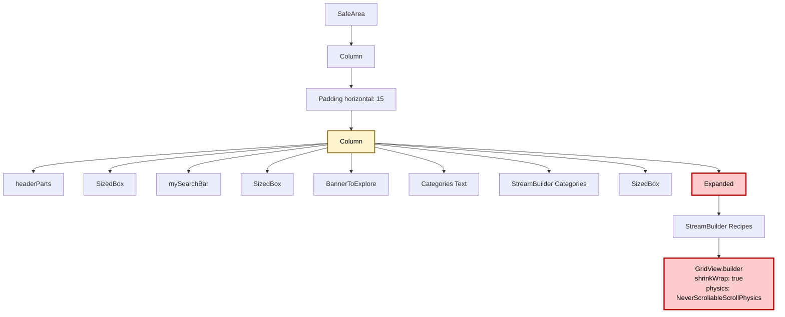
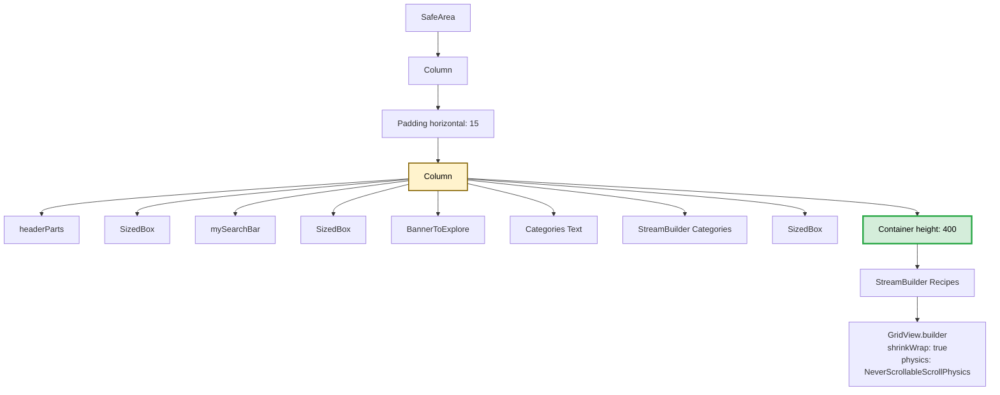
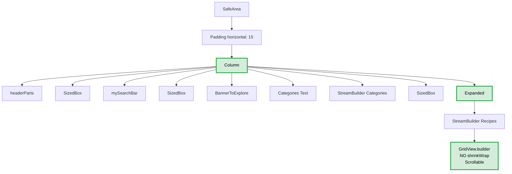
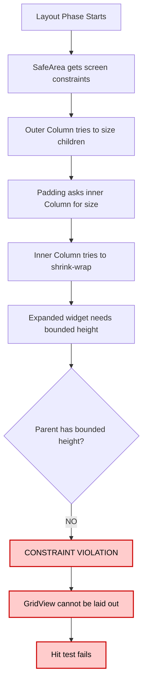
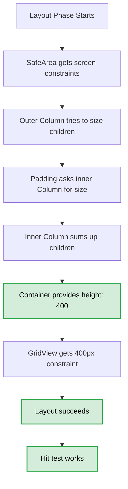
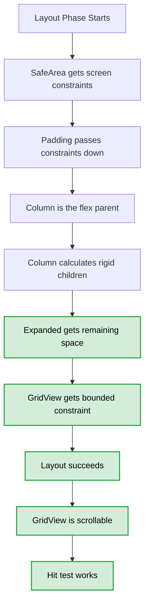

# Flutter Layout Analysis: app_main_screen Versions Comparison

## Executive Summary

**Version 1**: ❌ FAILS with "Cannot hit test a render box that has never been laid out"  
**Version 2**: ✓ Works (uses fixed height Container)  
**Version 3**: ✓ Works (restructured widget tree)

## The Problem

The error "Cannot hit test a render box that has never been laid out" occurs when Flutter tries to perform hit testing on a widget that hasn't been properly sized and positioned during the layout phase. This typically happens due to constraint violations in the widget tree.

## Widget Tree Structure Comparison

### Version 1 (BROKEN ❌)



**Problem**: The inner `Column` (D) is trying to shrink-wrap its children, but contains an `Expanded` widget (M). The `Expanded` widget needs the parent to provide bounded constraints, but the parent `Column` is itself unbounded in the vertical direction because it's inside a `Padding` that's inside another `Column`.

### Version 2 (WORKING ✓)



**Solution**: Replaced `Expanded` with `Container(height: 400)`. This gives the GridView a fixed height constraint, allowing the inner Column to properly size itself.

### Version 3 (WORKING ✓ - BEST APPROACH)



**Solution**: Restructured the widget tree so that:
1. `Padding` is directly under `SafeArea`
2. `Column` is inside `Padding`
3. `Expanded` is a direct child of the main `Column`
4. GridView is properly scrollable (removed `shrinkWrap` and `NeverScrollableScrollPhysics`)

## Key Code Differences

### Lines 75-118 Comparison

#### Version 1 ❌
```dart
return SafeArea(
  child: Column(                              // Outer Column
    crossAxisAlignment: CrossAxisAlignment.start,
    children: [
      Padding(
        padding: const EdgeInsets.symmetric(horizontal: 15),
        child: Column(                        // Inner Column (PROBLEM HERE)
          children: [
            // ... other widgets ...
            Expanded(                         // ❌ Expanded inside non-flex Column
              child: StreamBuilder<QuerySnapshot>(
                stream: ...,
                builder: (context, snapshot) {
                  return GridView.builder(
                    shrinkWrap: true,         // ❌ Conflicts with Expanded
                    physics: NeverScrollableScrollPhysics(),
                    // ...
```

#### Version 2 ✓
```dart
return SafeArea(
  child: Column(
    crossAxisAlignment: CrossAxisAlignment.start,
    children: [
      Padding(
        padding: const EdgeInsets.symmetric(horizontal: 15),
        child: Column(
          children: [
            // ... other widgets ...
            Container(                        // ✓ Fixed height instead of Expanded
              height: 400,                    // ✓ Explicit constraint
              child: StreamBuilder<QuerySnapshot>(
                stream: ...,
                builder: (context, snapshot) {
                  return GridView.builder(
                    shrinkWrap: true,
                    physics: NeverScrollableScrollPhysics(),
                    // ...
```

#### Version 3 ✓
```dart
return SafeArea(
  child: Padding(                             // ✓ Padding moved up
    padding: const EdgeInsets.symmetric(horizontal: 15),
    child: Column(                            // ✓ Column is now flex parent
      crossAxisAlignment: CrossAxisAlignment.start,
      children: [
        // ... other widgets ...
        Expanded(                             // ✓ Expanded in proper Column
          child: StreamBuilder<QuerySnapshot>(
            stream: ...,
            builder: (context, snapshot) {
              return GridView.builder(
                // ✓ No shrinkWrap, properly scrollable
                gridDelegate: ...,
                // ...
```

## Detailed Problem Explanation

### Why Version 1 Fails ❌



**The Constraint Conflict**:
1. The outer `Column` (line 76) is flexible and has bounded constraints from `SafeArea`
2. The `Padding` (line 79) passes constraints to its child
3. The inner `Column` (line 81) tries to shrink-wrap its children
4. The `Expanded` widget (line 118) requires its parent to have bounded constraints
5. **CONFLICT**: The inner `Column` cannot be both "shrink-wrap" and provide "bounded constraints" to `Expanded`

### Why Version 2 Works ✓



**Why It Works**: By replacing `Expanded` with `Container(height: 400)`, the inner Column can calculate its total height (sum of all children), and the GridView has explicit constraints.

**Drawback**: Fixed height means the GridView doesn't adapt to different screen sizes.

### Why Version 3 Works ✓ (BEST)



**Why It Works**: 
1. Proper widget hierarchy: `SafeArea` → `Padding` → `Column`
2. The main `Column` is the flex container
3. `Expanded` is a direct child of the flex container
4. The GridView is properly scrollable (no `shrinkWrap` or `NeverScrollableScrollPhysics`)
5. Responsive: adapts to any screen size

## Additional Improvements in Version 3

### 1. Removed Nested Column Anti-pattern
- **v1 & v2**: Column → Padding → Column (nested)
- **v3**: Padding → Column (single column)

### 2. Proper Scrolling Behavior
- **v1 & v2**: `shrinkWrap: true`, `physics: NeverScrollableScrollPhysics()` (tries to disable scroll)
- **v3**: Default scrolling (GridView scrolls naturally within Expanded)

### 3. Better Error Handling
```dart
// v3 checks connection state
if (snapshot.connectionState == ConnectionState.waiting) {
  return const Center(child: CircularProgressIndicator());
}
if (!snapshot.hasData || snapshot.data!.docs.isEmpty) {
  return const Center(child: Text("No recipes found"));
}
```

### 4. Horizontal Scrolling for Categories
```dart
// v1 & v2: Categories can overflow
return Row(children: categories.map(...).toList());

// v3: Categories scroll horizontally
return SingleChildScrollView(
  scrollDirection: Axis.horizontal,
  child: Row(children: categories.map(...).toList()),
);
```

### 5. Better Code Style
- More `const` constructors (performance)
- Cleaner null handling with `.toString()`
- Removed redundant `Spacer()` in favor of `Expanded`

## Flutter Layout Rules Violated in v1

### Rule 1: Expanded Must Be Direct Child of Flex Container ❌
```dart
// WRONG in v1
Column(                    // Not a flex parent for Expanded
  children: [
    Expanded(...)          // ❌ Parent Column is trying to shrink-wrap
  ]
)

// CORRECT in v3
Column(                    // IS the flex parent
  children: [
    Expanded(...)          // ✓ Direct child of flex container
  ]
)
```

### Rule 2: Don't Use shrinkWrap with Expanded ❌
```dart
// WRONG in v1
Expanded(
  child: GridView.builder(
    shrinkWrap: true,      // ❌ Conflicts with Expanded's purpose
    physics: NeverScrollableScrollPhysics(),
  )
)

// CORRECT in v3
Expanded(
  child: GridView.builder(
    // ✓ Let GridView scroll naturally
  )
)
```

### Rule 3: Unbounded Constraints in Vertical Axis ❌
The inner Column in v1 has unbounded height because:
- It's trying to shrink-wrap
- It contains an Expanded widget
- The parent Padding doesn't provide bounded constraints
- Creates an impossible constraint scenario

## Recommended Solution

**Use Version 3** because:
1. ✓ Proper widget hierarchy
2. ✓ Follows Flutter layout rules
3. ✓ Responsive to all screen sizes
4. ✓ Natural scrolling behavior
5. ✓ Better performance (proper use of `const`)
6. ✓ Better error handling
7. ✓ Categories scroll horizontally when many

## Summary Table

| Aspect | Version 1 ❌ | Version 2 ✓ | Version 3 ✓ |
|--------|-------------|-------------|-------------|
| **Works?** | NO | YES | YES |
| **Layout Structure** | Column → Padding → Column | Column → Padding → Column | Padding → Column |
| **Grid Container** | Expanded | Container(height: 400) | Expanded |
| **Grid Scrolling** | Disabled (shrinkWrap) | Disabled (shrinkWrap) | Enabled (natural) |
| **Responsive** | N/A (broken) | NO (fixed height) | YES (fills space) |
| **Categories Scroll** | NO (can overflow) | NO (can overflow) | YES (horizontal) |
| **Error Handling** | Basic | Basic | Enhanced |
| **Performance** | N/A | Good | Better (more const) |
| **Best Practice** | ❌ Violates rules | ⚠ Workaround | ✓ Follows rules |

## Conclusion

Version 1 fails because it violates Flutter's layout constraints system by nesting columns improperly and trying to use `Expanded` in a non-flex context. Version 2 works around this with a fixed height, but Version 3 is the proper solution that follows Flutter best practices and provides a responsive, scrollable layout.

